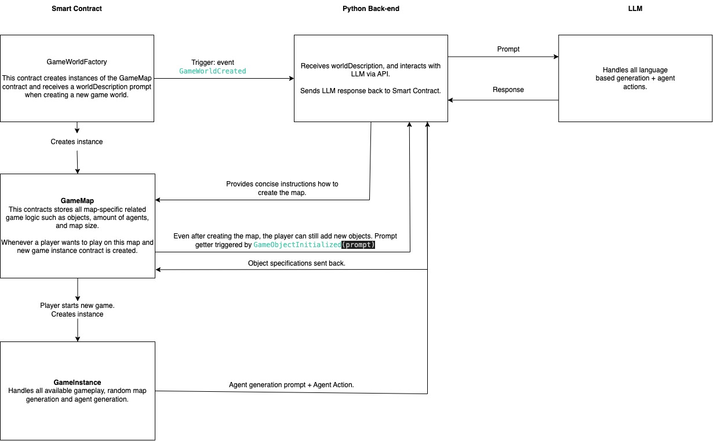

Smart contract architecture + intended interactions with back-end and LLM.

Open Tasks:
1. Automatically generate a grid map with random object placement based on tile rarity.

Open questions:
1. do we need to store the LLM prompt on chain?
